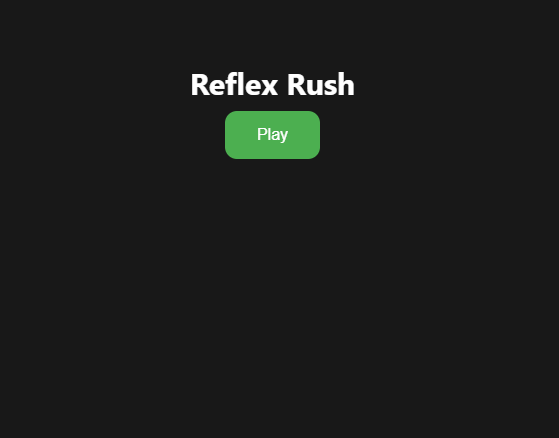
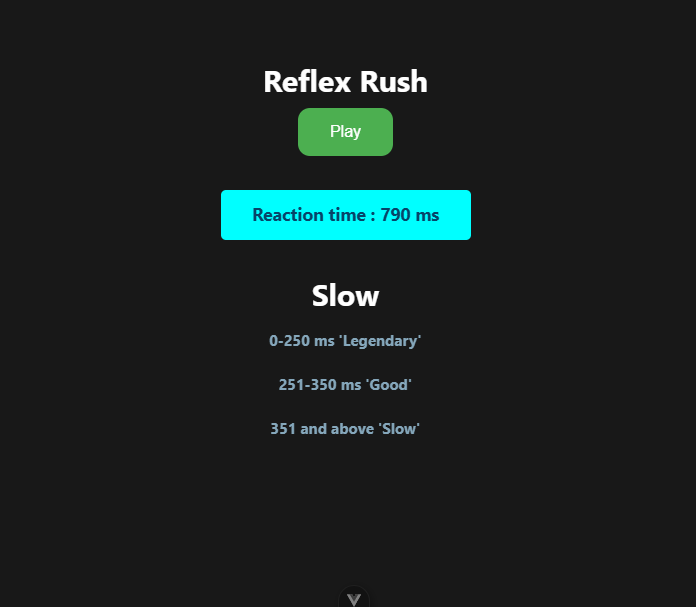

# Reflex Rush – A Vue.js Reaction Time Game 🎯  

🚀 **Test Your Reflexes with This Simple Game!**  

## 🎮 How It Works  
1️⃣ Click the "Play" button to start.  
2️⃣ Wait for a random delay… ⏳  
3️⃣ When the box appears, **click it as fast as you can!**  
4️⃣ Your reaction time determines your rank:  

   🏆 **Legendary** – Under 250ms  
   👍 **Good** – 251-350ms  
   🐢 **Slow** – Above 350ms  

## 🛠️ Built With  
- **Vue.js 3** (Composition API)  
- JavaScript  
- CSS  


## 📷 Screenshot  





## 🚀 Getting Started  
1️⃣ Clone the repo:

## Project Setup

```sh
npm install
```

### Compile and Hot-Reload for Development

```sh
npm run dev
```

### Compile and Minify for Production

```sh
npm run build
```
